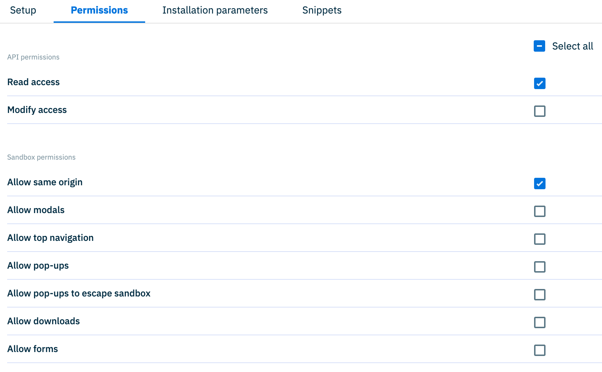

# dc-extension-automatic-alt-text

This extension gives the customer two different modes to select alt text for images in the Amplience Content Hub. The appropriate mode can be be configured in the extension parameters (see below for more information).

1. **Automatic mode:** by using the automatic mode customers can select alt text that has been automatically generated for images in the Amplience Content Hub using the [Automatic Alt Text](https://amplience.com/developers/docs/dev-tools/assets/image-alt-text/) solution which automatically assigns alt text to image assets.

2. **Generated mode:** by using the generated mode customers can generate alt text for images on the fly based on the [Alt Text Template](https://amplience.com/developers/docs/amplience-studios/content-studio/generating-content/#alt-text) in Content Studio.

Using this extension can help content creators by automating information required for accessibility and compliance.

For developers, it ensures that the alt text is available in the content form and supports localisation in our delivery APIs to minimise requests needed on the web applications.

Screenshot of extension on standard text field in automatic mode:


Screenshot of extension on localised text field in automatic mode:


## Key features

- Works with both standard text and localised text fields
- Ability to point to any native Amplience image (including those within extensions)
- Setting to turn on / off automatic population of fields on image selection
- Ability to choose locale for text fields
- Ability to click to refresh all alt text (in automatic mode)
- Ability to click to generate all alt text (in generated mode)
- Ability to refresh / generate alt text for individual localised fields (depending on mode selection)
- Ability to manually create alt text or edit in Dynamic Content
- Ability to use a brand voice for generated alt text

> Note: For all modes, this extension will allow the user to assign a locale when creating a content item <u>**prior to saving**</u> that will update the values of the default alt text to be that of the assigned locale.

## User Guide

This section describes how to use this extension from a user perspective in the CMS (Dynamic Content).

### General information

[Automatic Alt Text](https://amplience.com/developers/docs/dev-tools/assets/image-alt-text/) uses AI to generate alt text for image assets in the Amplience Content Hub.

This process is not always immediate so the following circumstances may require refreshing the alt text via the UI if no alt text is available at the time of selecting an image:

- Image has just been uploaded.
- Image has just been edited in [Image Studio](https://amplience.com/developers/docs/amplience-studios/image-studio/) via one of the extensions and saved.

See the [Limitations](#limitations) section for further guidance.

### Standard text field

The text field behaves as a normal text field and can be edited as such.

In automatic mode, clicking the Globe icon at the end of the text field (highlighted in red) will refresh the 'Default' alt text for that asset if available. This button will only show if alt text is available for this asset:


In generated mode, clicking the Sparkles icon at the end of the text field (highlighted in red) will generate the 'Default' alt text for that asset:


If using [Item level localisation](https://amplience.com/developers/docs/user-guides/produce-content/localize/#content-item-localization) this allows you to quickly select the right localised alt text for your content.

In automatic mode, when an asset is selected, if alt text is available for the asset a series of 'quick locale selector' buttons will be displayed below the text field:


Only options with alt text available will be displayed. The order of the locales displayed is the same order as the Alt text assigned to the image asset in Content Hub

In generated mode, options will be displayed to generate alt text based on the locales configured in the hub.

### Localised text field

The order of the text fields displayed is the order of the locales for your Dynamic Content Hub.

The text fields behave as normal localised text fields and can be edited as such.

In automatic mode, clicking the 'Refresh alt texts' button will auto populate all available alt text values for each locale if available. Clicking the Globe icon at the end of the text field will refresh the alt text for that locale. This icon is only visible if alt text is available for that locale.

In generated mode, clicking the 'Generate alt texts' button will generate alt text for all locales. Clicking the Sparkles icon at the end of the text field will generate alt text for that locale.

> Note: As this is a live request a loading visual is displayed when content is being generated as well as the fields temporarily being set to read only.

## How to install

### Register the Extension

This extension must be [registered](https://amplience.com/docs/development/registeringextensions.html) against a hub in the Dynamic Content application (Development -> Extensions).


- Category: Content Field
- Label: automatic-alt-text
- Name: Automatic Alt Text _(needs to be unique with the hub)_
- URL: [https://automatic-alt-text.extensions.content.amplience.net](https://automatic-alt-text.extensions.content.amplience.net)
- Description: Extension to automatically pull in available alt text for an image from the Amplience Content Hub for Compliance _(can be left blank, if you wish)_
- Initial height: 200

### Permissions



API permissions:

- Read access

Sandbox permissions:

- Allow same origin

### Installation Parameters


The extensions can be configured with a number of installation parameters which will determine how the extension operates.

| Installation Parameter                 | Required | Default                                                                            | Notes                                                                                                                                                |
| -------------------------------------- | :------: | ---------------------------------------------------------------------------------- | ---------------------------------------------------------------------------------------------------------------------------------------------------- |
| `image`                                |    ✅    |                                                                                    | [JSON pointer](https://datatracker.ietf.org/doc/html/rfc6901) to an image                                                                            |
| `mode`                                 |          | `"AUTOMATIC"`                                                                      | Can be `AUTOMATIC` ([Asset Alt Text](###dynamic-content-asset-alt-text)) or `GENERATED` ([Generated Alt Text](##dynamic-content-generated-alt-text)) |
| `autoCaption`                          |          | `true`                                                                             | Toggle auto caption                                                                                                                                  |
| `defaultLocale`                        |          | `"en-US"`                                                                          |                                                                                                                                                      |
| `generateAltTextSettings.templateId`   |          | `Q29udGVudEdlbmVyYXRpb25CcmllZlRlbXBsYXRlOmFsdC10ZXh0`                             | Only used for `GENERATED` mode.                                                                                                                      |
| `generateAltTextSettings.modelId`      |          | `Q29udGVudEdlbmVyYXRpb25Nb2RlbDpmY2E3ZTUzNS00YmE1LTRlODQtODkzYy0xMDg0YWM1ZGM0NDU=` | Only used for `GENERATED` mode                                                                                                                       |
| `generateAltTextSettings.brandVoiceId` |          |                                                                                    | Only used for `GENERATED` mode                                                                                                                       |

## Prerequisites

## Dynamic Content Asset Alt Text

This extension can be used in conjunction with [Automatic Alt Text](https://amplience.com/developers/docs/dev-tools/assets/image-alt-text/).

Whilst text can still inputted manually without this, if this feature is not enabled it is recommended to have your alt text as standard text / localised text fields.

### Dynamic Content Asset Tab

Your Dynamic Content Hub must have the [Asset Tab](https://amplience.com/developers/docs/user-guides/basics/dynamic-content/assets-tab/) enabled. This is to ensure API access to get the alt text meta data for the asset.

## Dynamic Content Generated Alt Text

This extension can also be used in conjunction with [Content Studio API](https://amplience.com/developers/docs/apis/content-studio/) to generate alt text on demand.

### Template ID property

Amplience has a default alt text template with ID: `Q29udGVudEdlbmVyYXRpb25CcmllZlRlbXBsYXRlOmFsdC10ZXh0`. Alternatively you can supply your own.

### Model ID property

Amplience has a default alt text model with ID: `Q29udGVudEdlbmVyYXRpb25Nb2RlbDpmY2E3ZTUzNS00YmE1LTRlODQtODkzYy0xMDg0YWM1ZGM0NDU=`. There are a number of models available to use which are listed in the [Model docs](https://amplience.com/developers/docs/apis/content-studio/#example-response-5)

### Brand Voice ID property (optional)

For generated alt text a [brand voice](https://amplience.com/developers/docs/apis/content-studio/#brand-voices) id can be provided as a parameter into the extension configuration. When alt text generation is requested, the extension will use the brand voice assigned to this property as the input.

## Suggested implementation

When using this extension for alt text for an image, it is recommended that you disable the standard alt text behaviour for your image so as to not confuse the content creators with multiple methods of inputing alt text.

Image of what is recommended to be disabled:


Example:

```json
"image": {
    "title": "Image",
    "allOf": [
        { "$ref": "http://bigcontent.io/cms/schema/v1/core#/definitions/image-link" }
    ],
    "ui:component": {
        "params": {
            "withAltText": false
        }
    }
}
```

See [Turning off Alt Text for a Media Card](https://amplience.com/developers/docs/dev-tools/assets/image-alt-text/#turning-off-alt-text-on-the-media-card) documentation for more details.

### Assign the extension to schema

To use the alt text extension, simply associate it with an image field and a string field (that represents the caption) in your content type schema.

The string field should be configured to use the `ui:extension` keyword, and use the name that was used to register the extension. An image param must be included to inform the extension which image property it should be linked to.

The `image` param should be a valid [JSON pointer](https://datatracker.ietf.org/doc/html/rfc6901).

```json
{
  "image": {
    "title": "Hero Image",
    "allOf": [
      {
        "$ref": "http://bigcontent.io/cms/schema/v1/core#/definitions/image-link"
      }
    ]
  },
  "alt": {
    "title": "Alt Text",
    "type": "string",
    "minLength": 0,
    "maxLength": 200,
    "ui:extension": {
      "name": "automatic-alt-text",
      "params": {
        "image": "/image"
      }
    }
  }
}
```

## Configuration

You can customize the alt text generator by providing `"params"` in the installation parameters, or inside your content type schema by adding them to `"params"` object in your `"ui:extension"`.

### Image property

The extension must be linked to an image property using a [JSON pointer](https://datatracker.ietf.org/doc/html/rfc6901). When a caption is requested, the extension will use the image assigned to this property as the input.

```json
{
  "image": "/pointer/to/image"
}
```

If the extension is used inside a partial that is included in multiple content types, you can use a [relative JSON pointer](https://www.ietf.org/id/draft-hha-relative-json-pointer-00.html) to define the image field.

```json
{
  "image": {
    "allOf": [
      {
        "$ref": "http://bigcontent.io/cms/schema/v1/core#/definitions/image-link"
      }
    ]
  },
  "alt": {
    "title": "Alt Text",
    "type": "string",
    "minLength": 0,
    "maxLength": 200,
    "ui:extension": {
      "name": "automatic-alt-text",
      "params": {
        "image": "1/image"
      }
    }
  }
}
```

If the extension is used in an array field, the pointer of the image field must be relative to the caption field

```json
{
  "images": {
    "title": "Images with captions",
    "type": "array",
    "minItems": 0,
    "maxItems": 10,
    "items": {
      "type": "object",
      "properties": {
        "image": {
          "title": "Hero Image",
          "allOf": [
            {
              "$ref": "http://bigcontent.io/cms/schema/v1/core#/definitions/image-link"
            }
          ]
        },
        "alt": {
          "title": "Alt Text",
          "type": "string",
          "minLength": 0,
          "maxLength": 200,
          "ui:extension": {
            "name": "automatic-alt-text",
            "params": {
              "image": "/image"
            }
          }
        }
      },
      "propertyOrder": []
    }
  }
}
```

If the extension is used for a localised text field with field level localisation then an example is below:

```json
{
  "image": {
    "allOf": [
      {
        "$ref": "http://bigcontent.io/cms/schema/v1/core#/definitions/image-link"
      }
    ]
  },
  "alt": {
    "title": "Alt Text",
    "allOf": [
      {
        "$ref": "http://bigcontent.io/cms/schema/v1/localization#/definitions/localized-string"
      }
    ],
    "minLength": 0,
    "maxLength": 200,
    "ui:extension": {
      "name": "automatic-alt-text",
      "params": {
        "image": "1/image"
      }
    }
  }
}
```

### Example snippets

Extensions can have [snippets](https://amplience.com/developers/docs/integrations/extensions/register-use/#adding-snippets-for-content-field-extensions) which make them easier to add and selectable in the Amplience Schema Editor.

Below are two example snippets for standard and localised text fields:

> Note: the `image` property should match a path to your image.

#### Standard alt text snippet

Title: `Auto Alt text (Standard)`
Description: `Snippet for the automatic alt text extension for a standard text field`
Snippet:

```json
{
  "type": "string",
  "title": "Image alt text",
  "description": "Alt text for the selected image",
  "ui:extension": {
    "name": "automatic-alt-text",
    "params": {
      "image": "{{PATH_TO_IMAGE_HERE}}"
    }
  }
}
```

#### Localised alt text snippet

Title: `Auto Alt text (localised)`
Description: `Snippet for the automatic alt text extension for a localised text field`
Snippet:

```json
{
  "title": "Image alt text",
  "description": "Alt text for the selected image",
  "allOf": [
    {
      "$ref": "http://bigcontent.io/cms/schema/v1/localization#/definitions/localized-string"
    }
  ],
  "ui:extension": {
    "name": "automatic-alt-text",
    "params": {
      "image": "{{PATH_TO_IMAGE_HERE}}"
    }
  }
}
```

#### Standard generate mode alt text snippet

Title: `Auto Alt text (standard)`
Description: `Snippet for the automatic alt text extension for a standard text field`
Snippet:

```json
{
  "title": "Image alt text",
  "description": "Alt text for the selected image",
  "allOf": [
    {
      "$ref": "http://bigcontent.io/cms/schema/v1/localization#/definitions/localized-string"
    }
  ],
  "ui:extension": {
    "name": "automatic-alt-text",
    "params": {
      "image": "{{PATH_TO_IMAGE_HERE}}",
      "mode": "GENERATED",
      "generateAltTextSettings": {
        "templateId": "{{TEMPLATE_ID_HERE}}",
        "modelId": "{{MODEL_ID_HERE}}",
        "brandVoiceId": "{{BRAND_VOICE_ID_HERE}}"
      }
    }
  }
}
```

#### Localised generated mode alt text snippet

Title: `Auto Alt text (localised)`
Description: `Snippet for the automatic alt text extension for a localised text field`
Snippet:

```json
{
  "title": "Image alt text",
  "description": "Alt text for the selected image",
  "allOf": [
    {
      "$ref": "http://bigcontent.io/cms/schema/v1/localization#/definitions/localized-string"
    }
  ],
  "ui:extension": {
    "name": "automatic-alt-text",
    "params": {
      "image": "{{PATH_TO_IMAGE_HERE}}",
      "mode": "GENERATED",
      "generateAltTextSettings": {
        "templateId": "{{TEMPLATE_ID_HERE}}",
        "modelId": "{{MODEL_ID_HERE}}",
        "brandVoiceId": "{{BRAND_VOICE_ID_HERE}}"
      }
    }
  }
}
```

### Disabling Auto caption

The extension will automatically fetch generated alt text from the image asset when the image property is populated instead of requiring the user to manually press the generate button.

Alt text will automatically update in two instances:

- a new image is added where none exists
- an existing image is changed

If you wish to disable auto caption, then use the following in your extension parameters:

```json
{
  "autoCaption": false
}
```

## Limitations

- This extension is only compatible with hubs that are linked to an organization. Accounts that have not yet [migrated](https://amplience.com/developers/docs/knowledge-center/faqs/account/) from legacy permissions will not see the AI caption feature.
- When using a localised string for alt text, filtering locales in the form will not filter the localised text fields displayed in the content form.
- When `autoCaption` is enabled, restoring the content item via the version history to a version that doesn't have alt text will send a graphql request that will populate the alt text field.
- Images must be hosted / served by Amplience.
- The image object that you configure to point to MUST be a standard Amplience image object as per the [data type](https://amplience.com/developers/docs/schema-reference/data-types/#image) and associated image link.
- Locales in Dynamic Content must match the locales for [Automatic Alt Text](https://amplience.com/developers/docs/dev-tools/assets/image-alt-text/) in Content Hub for population.
- Localised fields do not support min / max / pattern validation.
- Localised fields support required validation as a combination of all available alt text.
- Standard mode:
  - The extension pulls in alt text from the Amplience Content Hub to be used in Dynamic Content. Any edits / changes are in Dynamic Content only and not saved back to Content Hub.

